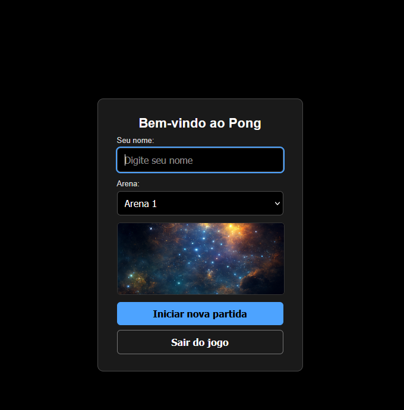
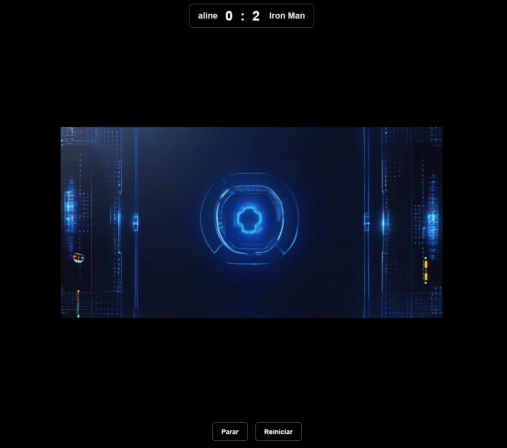
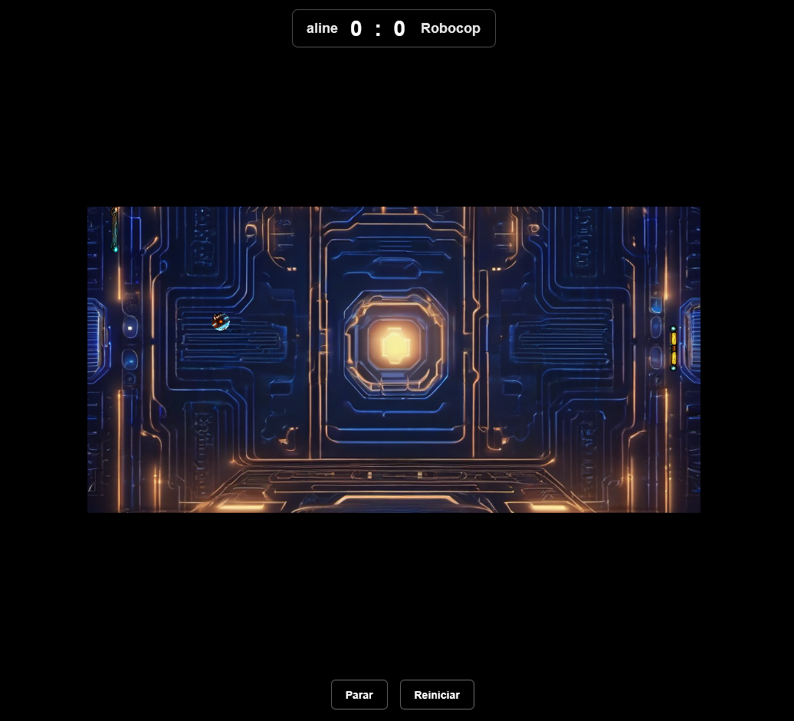
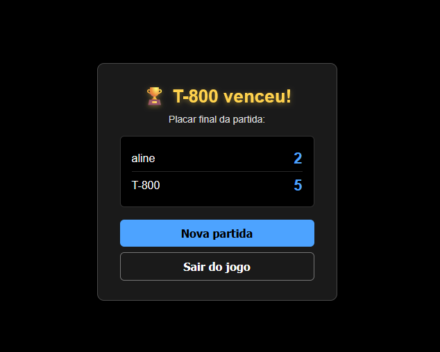

# 🏓 Pong

> 🇺🇸 [English version](#-english-version) · 🇧🇷 [Versão em Português](#-versão-em-português)

---

## 🇺🇸 English version

A modern reimplementation of the classic **Pong**, built with pure **p5.js** (no build step, no framework) and grown incrementally with the help of **GitHub Copilot**. The project starts as a simple game and gains a full HUD layer, menus, voice narration, arena selection, scoreboard, win condition and organized assets.

---

### 🎮 About the game

- **Player** controls the left paddle with the **mouse**.
- **CPU** controls the right paddle with a simple AI (follows the ball).
- The ball accelerates on every collision, making the match progressively harder.
- Each goal is narrated in **Portuguese** via the `speechSynthesis` API.
- **First to 5 points wins** the match, triggering a trophy modal.

---

### ✨ Features

#### Home screen / menu

- Welcome modal with:
  - Field to enter the **player name** (max 16 characters).
  - **Arena selector** (4 available scenarios).
  - **Live preview** of the selected arena.
  - **Start new match** and **Quit game** buttons.

# 🏓 Pong

---

This repository contains a modern reimplementation of the classic Pong game built with p5.js. Documentation is provided in two language sections: English first, then Portuguese.

---

## 🇺🇸 English

### Overview

A modern reimplementation of the classic **Pong**, built with pure **p5.js** (no build step, no framework). The project evolved incrementally and includes a complete HUD, menus, voice narration (pt-BR), arena selection, scoreboard, win condition and organized assets.

### Live demo / GitHub Pages

This project can be published to GitHub Pages. See the CI section below for details.

### Features

- Player controls the left paddle with the mouse.
- CPU controls the right paddle with a simple AI.
- Ball accelerates on collisions.
- Voice narration (pt-BR) announces points via Web Speech API.
- First to 5 points wins — triggers a victory modal with a trophy.

### Screenshots

- Home / Menu
  

- In-game HUD
  

- Pause modal
  

- Victory modal
  

### Project structure

```
.
├── index.html
├── style.css
├── sketch.js
├── README.md
└── assets/
    ├── images/
    └── sounds/
```

### Code architecture (high level)

- `Raquete` and `Bola` classes encapsulate paddle and ball logic.
- HUD is implemented using real DOM elements (divs / buttons) over the canvas.
- Simple AABB-style collision helper and robust ball handling to avoid sticking.
- State flags control UI flow (home menu, paused, in-game, victory).

### Running locally

No build required. Serve the folder over HTTP and open in browser:

```powershell
python -m http.server 8765
# then open http://localhost:8765
```

### Controls

- Move paddle: move the mouse vertically.
- Start match: "Start new match" button or Enter in name input.
- Pause/Stop: "Stop" button.
- Reset score: "Restart" button.

### CI / GitHub Actions (Pages deploy)

This repository contains a workflow at `.github/workflows/gh-pages.yml` that publishes the site to GitHub Pages.

- Trigger: push to `update-readme1` or `main`.
- Uses: `peaceiris/actions-gh-pages` to publish repository root to `gh-pages`.
- Permissions: uses `${{ secrets.GITHUB_TOKEN }}` with `permissions: contents: write` and `pages: write`.

How to trigger:

- Push to `update-readme1` or `main`.
- Force redeploy: `git commit --allow-empty -m "chore: trigger pages redeploy"` then push.

Troubleshooting:

- 403 errors: verify workflow permissions and branch protection rules on `gh-pages`.
- Wrong files: change `publish_dir` in the workflow.
- No index: ensure `index.html` exists in published folder.

### Development history

1. Initial refactor: constants, classes, stuck-ball bug fix.
2. HTML scoreboard.
3. Welcome modal with name field.
4. CPU name randomization.
5. Arena selector + live preview.
6. Centered canvas.
7. Restart and Stop buttons.
8. Pause modal with 10s countdown.
9. Voice narration for scoring.
10. Victory modal (5 points).
11. Assets organized under `assets/images` and `assets/sounds`.
12. Favicon from `bola.png`.

---

## 🇧🇷 Português

### Visão geral

Reimplementação do clássico **Pong**, construída com **p5.js** puro (sem build, sem framework). O projeto foi desenvolvido incrementalmente e inclui HUD, menus, narração por voz (pt-BR), seleção de arena, placar, condição de vitória e organização dos assets.

### Demonstração / GitHub Pages

O projeto pode ser publicado no GitHub Pages. Veja a seção de CI abaixo para detalhes.

### Funcionalidades

- Jogador controla a raquete esquerda com o mouse.
- CPU controla a raquete direita com IA simples.
- A bola acelera a cada colisão.
- Narração em pt-BR usando a Web Speech API.
- Primeiro a 5 pontos vence — modal de vitória com troféu.

### Capturas de tela

- Tela inicial / Menu
  

- HUD durante o jogo
  

- Modal de pausa
  

- Modal de vitória
  

### Estrutura do projeto

```
.
├── index.html
├── style.css
├── sketch.js
├── README.md
└── assets/
    ├── images/
    └── sounds/
```

### Arquitetura do código (visão geral)

- Classes `Raquete` e `Bola` encapsulam a lógica.
- HUD implementado com elementos DOM reais (divs / botões).
- Detecção de colisão simples e tratamento para evitar que a bola fique "grudada".
- Flags de estado controlam fluxo da UI (menu inicial, pausa, jogo, vitória).

### Como rodar localmente

```powershell
python -m http.server 8765
# abra http://localhost:8765
```

### Controles

- Mover raquete: mover o mouse verticalmente.
- Iniciar partida: botão "Iniciar nova partida" ou Enter no campo de nome.
- Pausar/Parar: botão "Parar".
- Reiniciar placar: botão "Reiniciar".

### CI / GitHub Actions (Publicação no Pages)

Este repositório contém um workflow em `.github/workflows/gh-pages.yml` que publica o site no GitHub Pages.

- Gatilho: push para `update-readme1` ou `main`.
- Usa: `peaceiris/actions-gh-pages` para publicar a raiz do repositório em `gh-pages`.
- Permissões: usa `${{ secrets.GITHUB_TOKEN }}` com `permissions: contents: write` e `pages: write`.

Como disparar:

- Faça push para `update-readme1` ou `main`.
- Forçar redeploy: `git commit --allow-empty -m "chore: trigger pages redeploy"` e dê push.

Solução de problemas:

- Erro 403: verifique permissões do workflow e proteção de branch `gh-pages`.
- Arquivos errados: ajuste `publish_dir` no workflow.
- Sem index: garanta que `index.html` exista na pasta publicada.

### Histórico de evolução

1. Refatoração inicial: constantes, classes, correção do bug da bola.
2. Placar em HTML.
3. Modal de boas-vindas com campo de nome.
4. Nome da CPU aleatório.
5. Seletor de arenas + pré-visualização.
6. Canvas centralizado.
7. Botões Reiniciar e Parar.
8. Modal de pausa com contador de 10s.
9. Narração por voz.
10. Modal de vitória (5 pontos).
11. Organização de assets em `assets/images` e `assets/sounds`.
12. Favicon com `bola.png`.

---

Made with ❤️ — contributions welcome.

- Mostra **placar final da partida**.
- Contador regressivo de **10 segundos** que retorna automaticamente para a tela inicial.

#### Modal de vitória (5 pontos)

- Título com 🏆 em dourado e nome do vencedor.
- Resumo do placar.
- Botões **Nova partida** (volta para o menu inicial) e **Sair do jogo**.

#### Áudio e voz

- **Som de quique** quando a bola colide com uma raquete.
- **Som de gol** quando alguém pontua.
- **Narração por voz** (`pt-BR`) a cada ponto, falando apenas o nome do jogador que pontuou e sua pontuação atual.

#### Visual

- Canvas **800x400** centralizado na tela, com fundo preto ao redor.
- Bola gira proporcionalmente à sua velocidade (`rotate` em função da magnitude do vetor).
- Arena renderizada com **letterbox-zoom** (preserva proporção sem distorcer).
- **Favicon** personalizado usando `bola.png`.

---

### 🗂️ Estrutura do projeto

```
.
├── index.html              # shell HTML, carrega p5, p5.sound, CSS e sketch
├── style.css               # estilos de HUD, modais, botões e placar
├── sketch.js               # toda a lógica do jogo (classes, estado, HUD, modais)
├── README.md
└── assets/
    ├── images/
    │   ├── bola.png        # também usada como favicon
    │   ├── barra01.png     # raquete do jogador
    │   ├── barra02.png     # raquete da CPU
    │   ├── Arena2.png      # Arena 1
    │   ├── Arena3.jpg      # Arena 2
    │   ├── Arena4.jpg      # Arena 3
    │   └── Arena5.jpg      # Arena 4
    └── sounds/
        ├── 446100__justinvoke__bounce.wav                     # quique
        └── 274178__littlerobotsoundfactory__jingle_win_synth_02.wav  # gol
```

---

### 🧩 Arquitetura do código (`sketch.js`)

- **Bloco de constantes** no topo agrupa toda a configuração do jogo (dimensões, velocidades, aceleração, pontos para vencer, estilos do placar).
- **Classe `Raquete`**: encapsula posição, dimensões, sprite e movimento. Recebe o flag `ehJogador` para alternar entre controle por mouse e IA simples.
- **Classe `Bola`**: encapsula posição, velocidade, rotação e colisões. As colisões com as raquetes forçam o vetor `vx` no sentido correto (`Math.abs(vx)` ou `-Math.abs(vx)`) multiplicado por `BOLA_ACELERACAO_COLISAO`, evitando o bug clássico de "bola grudada" oscilando dentro da raquete.
- **Função `colideRetanguloCirculo`**: detecção AABB simplificada.
- **Sistema de HUD em DOM puro**: placar, botões e modais são `<div>`/`<button>` reais anexados ao `document.body` e posicionados via CSS `position: fixed`, em vez de desenhados no canvas. Isso desacopla a UI do loop de renderização e facilita a estilização.
- **Fluxo de estado** controlado por flags (`jogoIniciado`, `jogoPausado`) e pelas funções `mostraModalNome`, `voltaTelaInicial`, `paraJogo`, `verificaVitoria`, `mostraModalVitoria`, `mostraTelaSaida`.
- **`escapaHtml`** sanitiza qualquer texto inserido pelo usuário antes de cair em `innerHTML` (defesa contra injeção via campo de nome).

---

### 🚀 Como rodar localmente

Não há build. Basta servir os arquivos por HTTP (necessário para `loadSound` / `loadImage`).

```bash
python3 -m http.server 8765
```

Depois abra <http://localhost:8765> no navegador.

---

### ⌨️ Controles

| Ação              | Como                                                       |
| ----------------- | ---------------------------------------------------------- |
| Mover raquete     | Mexer o **mouse** verticalmente                            |
| Iniciar partida   | Botão **Iniciar nova partida** ou `Enter` no campo de nome |
| Pausar / encerrar | Botão **Parar**                                            |
| Reiniciar placar  | Botão **Reiniciar**                                        |

---

### 🛠️ Tecnologias

- [p5.js 1.6.0](https://p5js.org/) — canvas e loop de renderização.
- [p5.sound](https://p5js.org/reference/#/libraries/p5.sound) — efeitos sonoros.
- **HTML + CSS + JavaScript** vanilla — HUD, modais e estilos.
- **Web Speech API** (`SpeechSynthesisUtterance`) — narração dos pontos.

---

### 📌 Histórico de evolução

Cada item abaixo foi implementado e validado de forma incremental ao longo do desenvolvimento:

1. Refatoração inicial: bloco de constantes, separação em classes `Raquete` e `Bola`, correção de typo e do bug de bola grudada.
2. Placar em HTML fixo no topo central.
3. Modal de boas-vindas com campo de nome.
4. Nome da CPU sorteado de uma lista temática.
5. Seletor de arenas com 4 opções e pré-visualização ao vivo.
6. Centralização do canvas com fundo preto ao redor.
7. Botões **Reiniciar** e **Parar** centralizados na parte inferior.
8. Modal de pausa com **contador regressivo de 10s** que retorna ao menu inicial.
9. Narração por voz apenas do jogador que pontuou.
10. Condição de vitória ao atingir **5 pontos** + modal de troféu.
11. Reorganização de assets em `assets/images/` e `assets/sounds/`.
12. Favicon usando `bola.png`.

---

### 📷 Capturas de tela

- Imagem 1 — Tela inicial  
  

- Imagem 2 — HUD do jogo  
  

- Imagem 2.1 — Modal de pausa  
  

- Imagem 3 — Modal de vitória  
  

---
